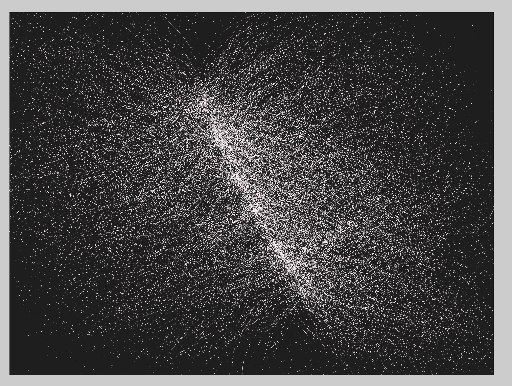
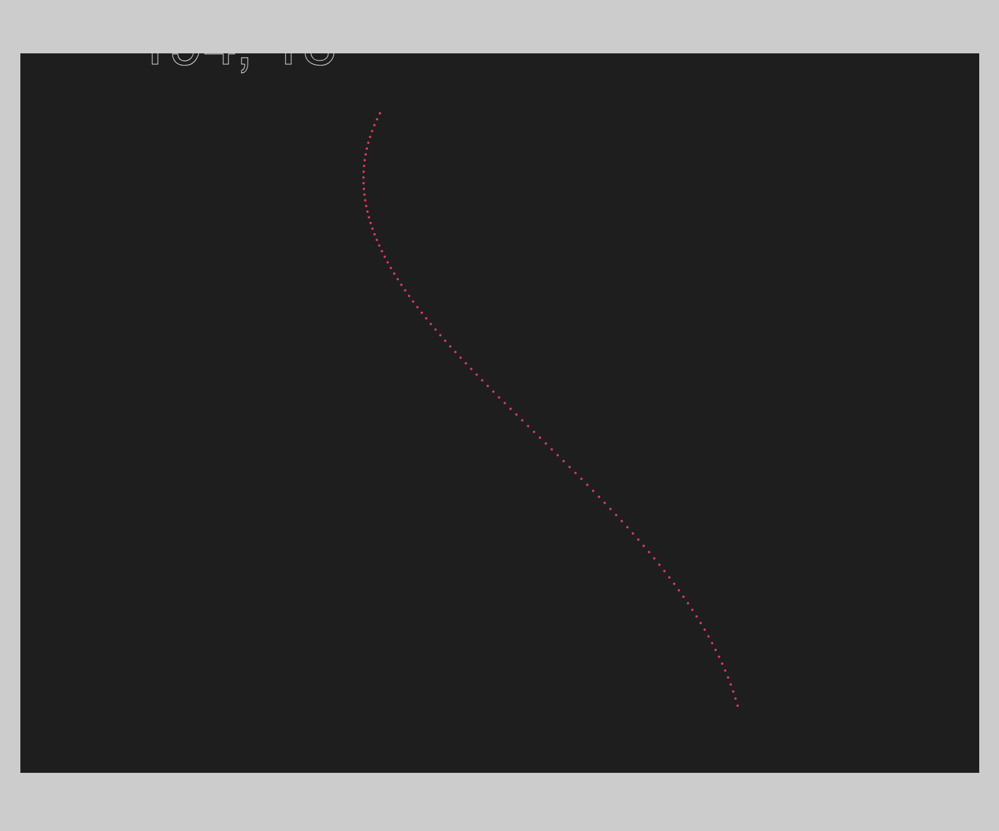
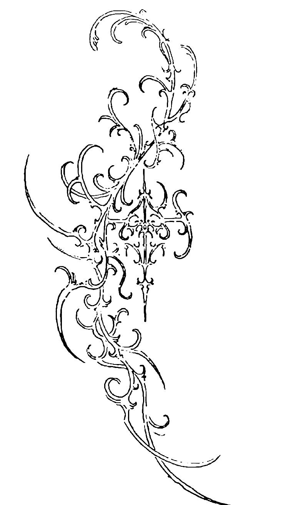

# ok so basically huge neuron 
i wanted it to be cybersigilism originally but now its neuron
this means something for sure but idk what

made with p5 js and bezier curves and ellipsis and a little nested loop and some randomness

this was it like two days ago

with some settings messed around. what is it??

this was what i wanted originally

